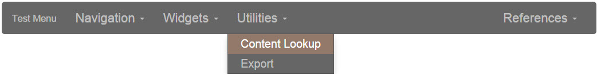
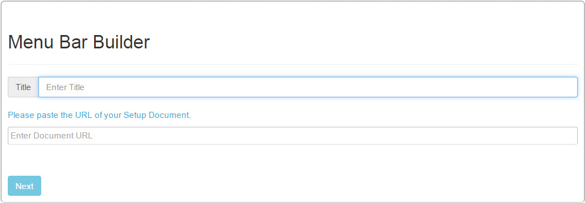
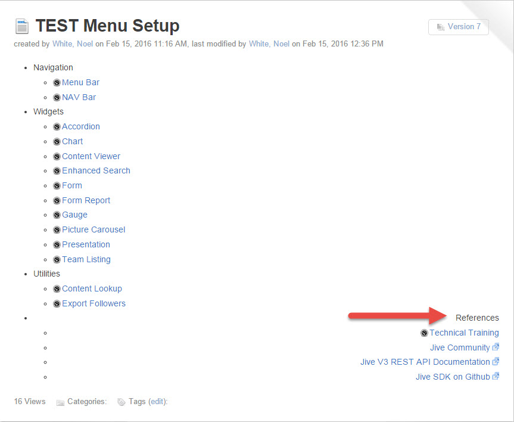
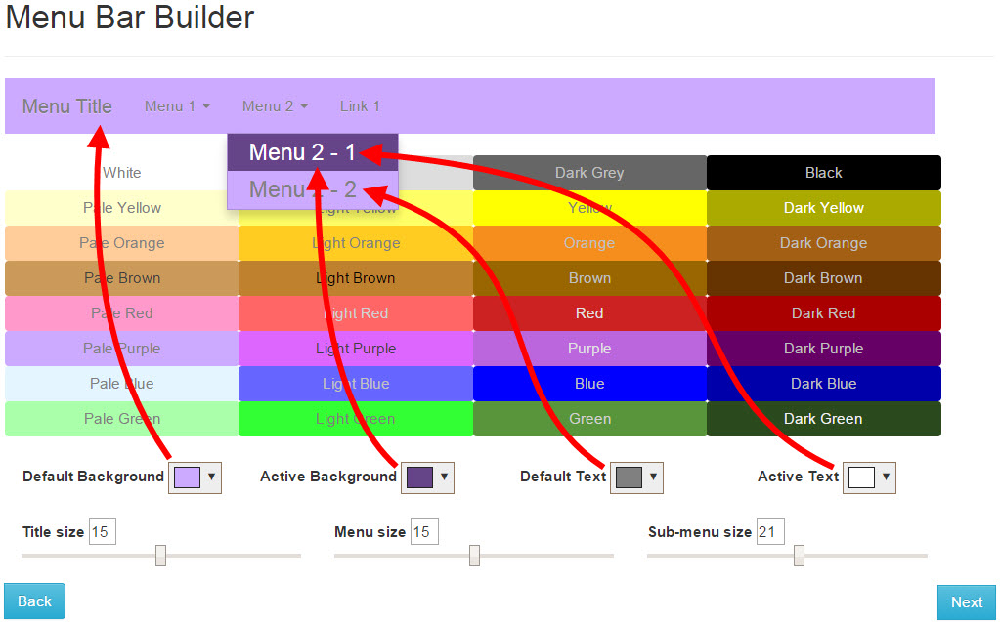
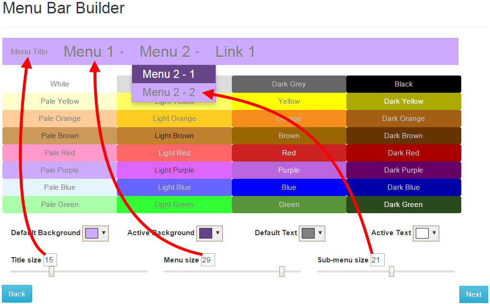

Jive - Menu Widget
==================
<p></p>
The Menu widget is a great tool for controlling site navigation, both in and out of your [Jive](https://community.jivesoftware.com/welcome) instance.  This is an HTML widget project that guides users through related sites, helps them navigate through complex business units, and organizes your site topics and eases access in your community.  Creating a menu in your site is now as simple as creating a Jive document with a bullet list of your menu items.  A builder application takes the setup document and generates the code for you.

Prerequisite
------------
The [Content Lookup](https://github.com/fmr-llc/jive-content-lookup) widget installation has essential parts of setting up this widget project.  Make sure to install this widget prior to continuing with the Menu widget installation.

Upload Menu Libraries
---------------------
* Download this project's Zip archive and extract it to your local computer.
* Log into your Jive community.
* Navigate to the upload location for your library files.
* Create an Uploaded File in the Library location of your Jive community.  Drag the file "menu_widget_builder.css" to the file section of the upload.  Set the file name to "Menu Widget Builder CSS Library", put a description of your choosing, tag it, set the authors, and make sure it is being published to the correct Library location.  Click Publish.
* Create another Uploaded File in the Library location of your Jive community.  Drag the file "menu_widget_builder.js" to the file section of the upload.  Set the file name to "Menu Widget Builder JavaScript Library", put a description of your choosing, tag it, set the authors, and make sure it is being published to the correct Library location.  Click Publish.

Download Spectrum
-----------------
[Spectrum Color Picker](https://github.com/bgrins/spectrum) is a library that several of these widget projects will use for customizing your preferences.  You will need to check if you have this installed from a previous widget installation.  If not, you need to obtain a copy of this library and store specific files in your Jive instance for use.  Follow these instructions to check for status, and download the latest version and upload to your community if required:
* Use the Content Lookup widget to search for "Spectrum JavaScript Library".  If the file is returned in the search, you can assume it is already installed, and can skip the rest of this section.  Otherwise, continue with the below steps to download Spectrum and install it in your Jive installation.
* Click [Spectrum download](https://github.com/bgrins/spectrum/archive/master.zip) to get the latest version or use a version used by your front end developers.
* (Optional) Perform any required security checks on the downloaded code.
* Extract the zip file to your computer.
* Log into your Jive community.
* Navigate to the upload location for your library files.
* Create an Uploaded File in the Library location of your Jive community.  Look in the Spectrum archive on your computer.  Expand the dist folder.  Drag the file "spectrum.css" to the file section of the upload.  Set the file name to "Spectrum CSS Library", put a description of your choosing, tag it, set the authors, and make sure it is being published to the correct Library location.  Click Publish.
* Create another Uploaded File in the Library location of your Jive community.  Go back to the Spectrum archive.  Drag the file "spectrum.js" to the file section of the upload.  Set the file name to "Spectrum JavaScript Library", put a description of your choosing, tag it, set the authors, and make sure it is being published to the correct Library location.  Click Publish.

Update Library Loader
---------------------
* Use the Content Lookup widget to search for "Library Loader".  Click the link to the file in the results.  If it is not found, contact your administrator.
* Download a copy of the "Library Loader" file from your community.  Open it for editing.
* Go back to the Content Lookup widget and search for "Menu Widget".  You should see the two library files you uploaded to your community above.
* Find the search result for "Menu Widget Builder CSS Library" and copy its Content ID.  It should be a number like 694225.
* Update the library_loader.js file line for "menu_widget_builder.css" and update the content ID variable (it should be 0 before updating) to the Content ID from step 4.  The result should look similar to:
```
	libraries['menu_widget_builder.css'] = { contentID: '694225' };
```
* Find the search result for "Menu Widget Builder JavaScript Library" and copy its Content ID.  It should be a number like 694226.
* Update the library_loader.js file line for "menu_widget_builder.js" and update the content ID variable (it should be 0 before updating) to the Content ID from step 6.  The result should look similar to:
```
	libraries['menu_widget_builder.js'] = { contentID: '694226' };
```
* Use the Content Lookup widget to search for "Spectrum".  You should see results for the CSS and Javascript libraries uploaded above.
* Find the search result for "Spectrum CSS Library" and copy its Content ID.  It should be a number like 694227.
* Update the library_loader.js file line for "spectrum.css" and update the content ID variable (it should be 0 before updating) to the Content ID.  If a line for "spectrum.css" is not present in your Library Loader, then just add the line below with the correct Content ID in it.  The result should look similar to:
```
	libraries['spectrum.css'] = { contentID: '694227' };
```
* Find the search result for "Spectrum JavaScript Library" and copy its Content ID.  It should be a number like 694228.
* Update the library_loader.js file line for "spectrum.js" and update the content ID variable (it should be 0 before updating) to the Content ID from step 10.  The result should look similar to:
```
	libraries['spectrum.js'] = { contentID: '694228' };
```
* Save the changes to the library_loader.js file on your computer.
* Edit the "Library Loader" uploaded file in your Jive community.
* Drag the updated file from your computer to the file section of the uploaded file.  Click Publish.
You have now updated the Library Loader in your Jive community with the library files needed to run the Menu widget.

Install the Menu Builder application
------------------------------------
* Use the Content Lookup widget to search for "jQuery Library".  Copy the Content ID.  It should be a number like "694224"
* Look in the Menu archive on your computer and edit the "menu_widget_builder.html" file.
* Find the jquery_content_id and replace the zero in the quotes with the Content ID copied in step 1.  The result should look similar to:
```
	var jquery_content_id = "694224";
```
* Go back to the Content Lookup widget and get the Binary URL for "jQuery Library".  It should look similar to:
```
	https://myjiveinstance.mycompany.com/api/core/v3/attachments/file/694224/data
```
* Edit the "menu_widget_builder.html" file again.
* Find the line:
```
    <script src='JQUERY'></script>
```
replace the text JQUERY with the URL you copied in step 4.  It should end up looking similar to:
```
    <script src='https://myjiveinstance.mycompany.com/api/core/v3/attachments/file/694224/data'></script>
```
* Use the Content Lookup widget to search for "Library Loader".  Copy the Content ID.
* Edit the "menu_widget_builder.html" file again.
* Find the library_loader_content_id and replace the zero in the quotes with the Content ID copied in step 1.  The result should look similar to:
```
	var library_loader_content_id = "694223";
```
* Save the file.
* Go to the site you want to put the Menu Builder application in your community, and go to the Overview page.
* Manage the Overview page, and drag a new HTML widget onto the page.
* Edit the new HTML Widget.
* Copy the updated code from "menu_widget_builder.html" and paste it into the "Your HTML" entry field in the new widget.
* Click "Save Properties".
* Click "Publish Layout".
<p>Your Menu Builder is now set up.</p>
<p></p>
<p>Site admins can use the below instructions to create their own menus...</p>

Creating a Menu Setup document
------------------------------
* Create a Jive document.
* Click the Bullet List button in the editor.
* Create a bullet list of items that will make up the top level menu items.  Any top level menu item that will not have a sub-menu should be made into a hyperlink to the destination page when that menu item is clicked.  Do not change any styling of this list, such as font size and color.  The builder application will allow changing the font size, and colors of the menu.
* Any top level menu item that is going to have a sub-menu should NOT be a hyperlink.  Sub-menus are created by indenting the bullet list, and entering the sub-menu items.  Each of these sub-menu items must be a hyperlink to the destination for that item when clicked.
<p></p>
* Right aligning a top level menu item on the page will right-align top level menu items from there on.  See the example menu at the end of the next section to see what this does.
* Once your menu setup document is completed, publish the document and copy the URL.

Build the Menu
--------------
* Go to the Overview page that you installed the Menu Builder application.
* Enter a title (displays at the very left of the menu), and paste the menu setup document URL you copied in the section above.
* Click Next and the styling screen displays.  The example menu at the top defaults to the White color palette.
<p></p>
* Choose the color from the palette that most closely matches your desired menu color.  You can fine-tune the colors with the color selectors below the palette.
<p></p>
* Set the font sizes to the desired sizes.  You can set the sizes for the Title, top level menu items, an sub-menu items.
* Once satisfied with your menu configuration, click Next.  This will generate the code for your menu.  Copy the generated code.
* Go to the overview page you want to put the menu.
* Drag an HTML Widget into a column.  Make sure to put the widget into a column sufficiently wide to display your menu.
* Edit the widget.  Paste the menu code.
* Click on Save Properties.
* Publish the page.
<p></p>

Usage
-----
<p>Once the Menu is setup and operational, users can utilize the meu items for navigation.</p>
<p>If changes are needed, update the setup document and re-generate the menu.</p>

Issues
------
If your widget is not working as expected, please check out [Issues](docs/issues.md)

Additional Jive-n widget projects in this series
------------------------------------------------
* [Accordion widget](https://github.com/fmr-llc/jive-accordion)
* [Content Lookup](https://github.com/fmr-llc/jive-content-lookup)
* [Content Viewer widget](https://github.com/fmr-llc/jive-content-viewer)
* [Export widget](https://github.com/fmr-llc/jive-export-followers)
* [Form widget](https://github.com/fmr-llc/jive-form)
* [Form Report widget](https://github.com/fmr-llc/jive-form-report)
* [Picture Carousel widget](https://github.com/fmr-llc/jive-picture-carousel)
* [Presentation widget](https://github.com/fmr-llc/jive-presentation)
* [Search widget](https://github.com/fmr-llc/jive-advanced-search)
* [Team Listing widget](www.github.com/fmr-llc/jive-team-listing)

Contributing
------------
If you would like to contribute to this project, please check out [Contributing](docs/contributing.md)

License
-------
(c) 2015-2016 Fidelity Investments
Licensed under the [Apache License](docs/LICENSE), Version 2.0